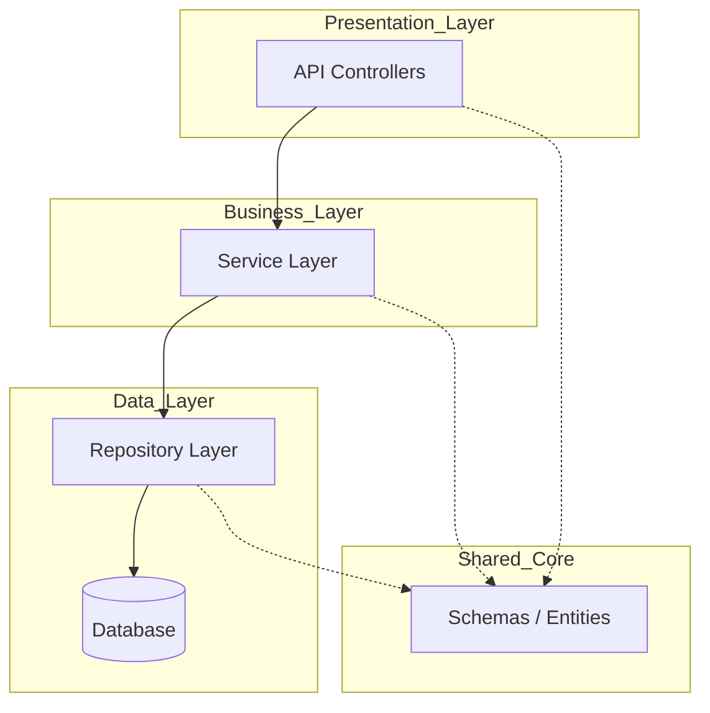
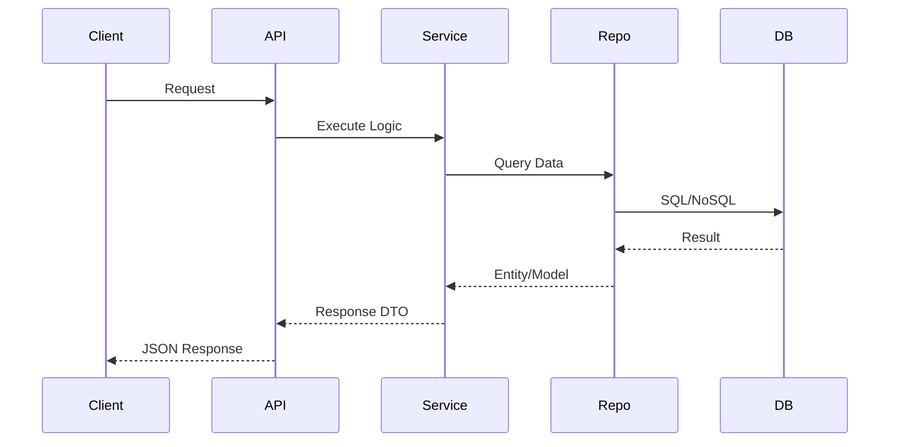

# System Architecture

## Layered Overview

```mermaid
graph TD
    subgraph Presentation_Layer
        API[API Controllers]
    end

    subgraph Business_Layer
        Service[Service Layer]
    end

    subgraph Data_Layer
        Repo[Repository Layer]
        DB[(Database)]
    end

    subgraph Shared_Core
        Schemas[Schemas / Entities]
    end

    API --> Service
    Service --> Repo
    Repo --> DB
    
    %% Common dependencies
    API -.-> Schemas
    Service -.-> Schemas
    Repo -.-> Schemas
```

## Data Flow

```mermaid
sequenceDiagram
    Client->>API: Request
    API->>Service: Execute Logic
    Service->>Repo: Query Data
    Repo->>DB: SQL/NoSQL
    DB-->>Repo: Result
    Repo-->>Service: Entity/Model
    Service-->>API: Response DTO
    API-->>Client: JSON Response
```